**SENG 637- Dependability and Reliability of Software Systems***

**Lab. Report \#5 – Software Reliability Assessment**

| Group \#:       | 14  |
|-----------------|---|
| Student Names:  | Matjaz  |
|                 | Paul  |
|                 | Marie  |
|                 | Ian  |

# Introduction

This lab examines the use of Reliability Growth Testing and Reliability Demo Chart to assess system reliability. It uses a variety of tools provided in the assignment files.

# Assessment Using Reliability Growth Testing 

The Laplace test was calculated using CASRE. The user guide for CASRE indicated that the failure data must have equal interval times. Since the provided failure dataset had unequal intervals, it was modified to fit the correct form. To do so, the failure count data was redistributed into intervals of 15 person hours of failure identifying time (column F). The resulting dataset is shown below.

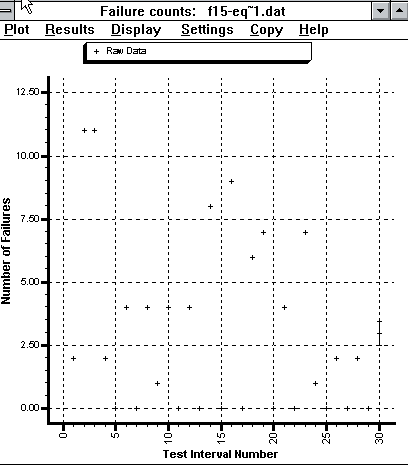

The Laplace test results are shown below:

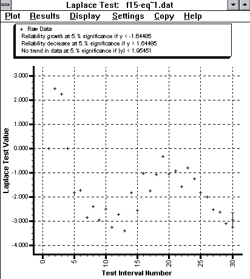

The Laplace test indicates that from test interval 5 and onward, Laplace factor is negative, indicating stable or positive reliability growth. The useful range of data is therefore from interval 5 and onward. In the unmodified dataset, this corresponds to interval 9 and onward.

Unfortunately, there seemed to be an error in the CASRE installation, resulting in no models being available for analysis. See below for the model selection window with no models:

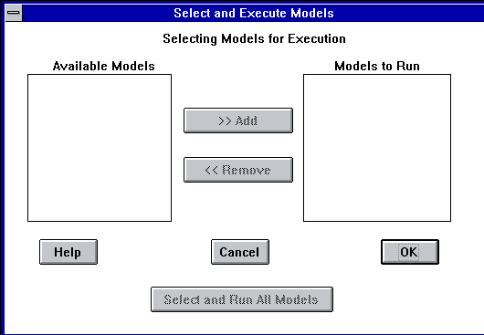

The graphs are therefore displayed without models.

Time Between Failures

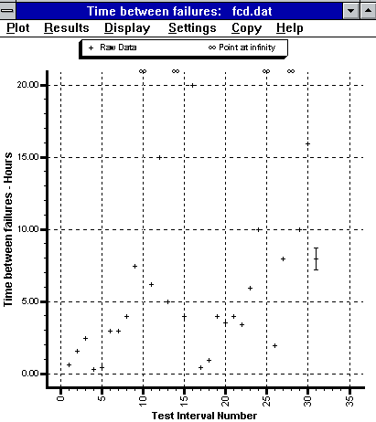

Failure Intensity

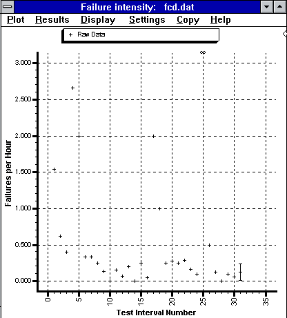

Reliability

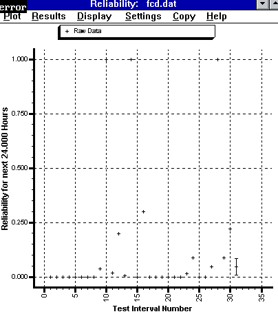

C-SFRAT v1.1 was therefore used for modeling. The data used in the modeling was limited to the useful range determined by the Laplace Test. All combinations of possible models and available covariates were assessed for goodness of fit. The top performing models were chosen using SSE. The chosen models are:
- Truncated Logistic, F,C
- Truncated Logistic, F
- Truncated Logistic, E,F
- Discrete Weibull (Order 2), E, F, C

A screenshot of the model assessment tab is shown below:
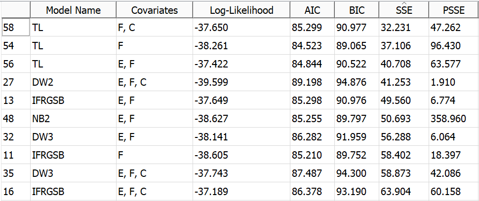

The cumulative failure graph with the chosen models is shown below. The prediction for the next 5 failures is shown as well:
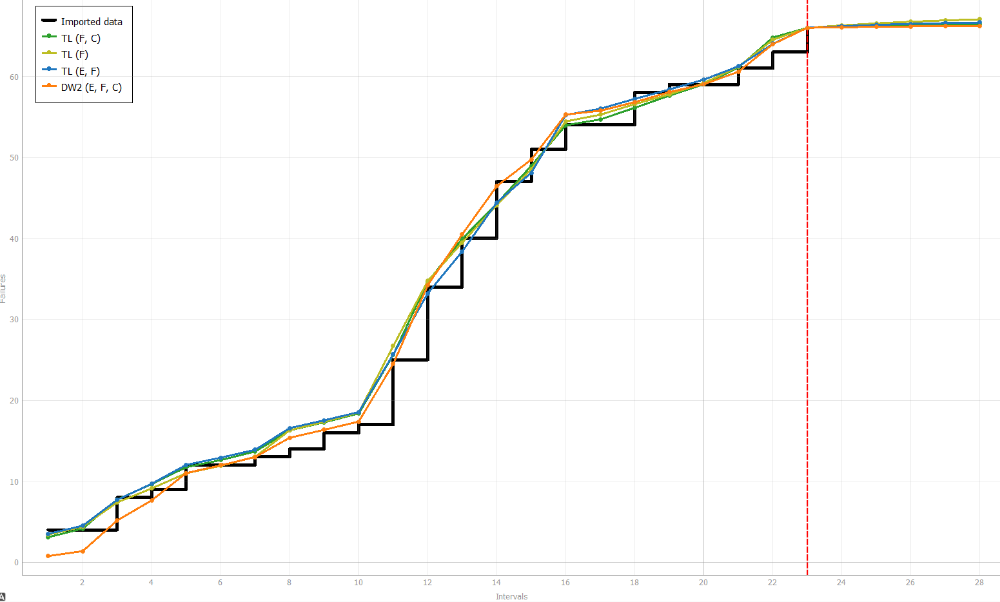

The Intensity Graph with the chosen models is shown below:
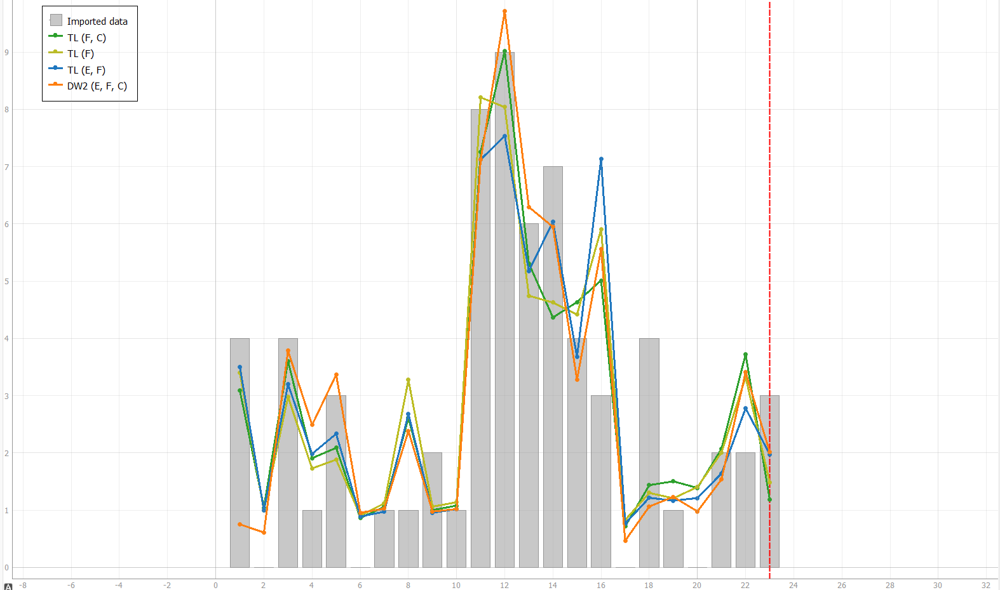

## Discussion

The selected models applied to the useful range of data indicate a very low failure rate in the future. The models predict 0 or 1 failures in the next 5 failure identification person hour intervals. This indicates a very high reliability. These results should be acceptable for any development program.

In a general scenario, the acceptable failure rate would have to be determined in consideration of the software purpose. Critical, life dependant software might require a low failure rate, while less critical software might allow for more failures. The reliability would then be assessed using the historic failure rate and a decision to release or not could be made by comparing the predicted results against the required rate.

Reliability Growth Analysis is a useful method of analytically measuring software reliability. It can be used as an objective requirement of software quality when determining if the product is ready for release. However, accurate analysis results requires a large number of failures to be experienced before the analysis is conducted. It is also less accurate for smaller programs.

# Assessment Using Reliability Demonstration Chart 
We attempted to use the Excel RDC tool to plot failure and reliability trends. Unfortunately, the tool is not designed to handle data exceeding 16 failures or 16 time intervals. These values appear to be hard-coded into the plotting calculations. Since our cumulative failure count of 92, and the cumulative chosen input event (testing hours) of 433, both exceed those limits, only the first few data points are visible on the graph. MTTF variations were therefore assessed using the few points visible.

The risk profile for all plots were the same:
- Discrimination Ratio: 2.0
- Developer's Risk: 0.1
- User's Risk: 0.1

Failure data:
| Cumulative Failure Count | Testing Hours |
| ------------------------ | ------------------------- |
| 2                        |                        1  |
| 13                       |                      19   |
| 15                       |                      24   |
| 19                       |                      26   |
| 22                       |                      27   |
| 23                       |                      30   |
| 24                       |                      33   |
| 26                       |                      41   |
| 30                       |                      71   |
| 30                       |                      80   |
| 34                       |                    105    |
| 35                       |                    120    |
| 38                       |                    135    |
| 38                       |                    137    |
| 39                       |                    141    |
| 40                       |                    161    |
| 42                       |                    162    |
| 43                       |                    163    |
| 51                       |                    195    |
| 60                       |                    227    |
| 66                       |                    251    |
| 73                       |                    275    |
| 77                       |                    299    |
| 80                       |                    329    |
| 80                       |                    329    |
| 84                       |                    337    |
| 85                       |                    345    |
| 85                       |                    357    |
| 87                       |                    377    |
| 89                       |                    409    |
| 92                       |                    433    |

Testing hours was chosen as the input event as it would be a useful metric to make business dicisions from. 

The minimum MTTF at which SUT is acceptable is 1.667 failure identification person hours, which corresponds to an FIO of 6 failures per 10 identification hours. At this point, the farthest visible failure point enters the acceptable region. Since the data enters the acceptable region, the SUT would be considered reliable enough for release.

Minimum acceptable MTTF:

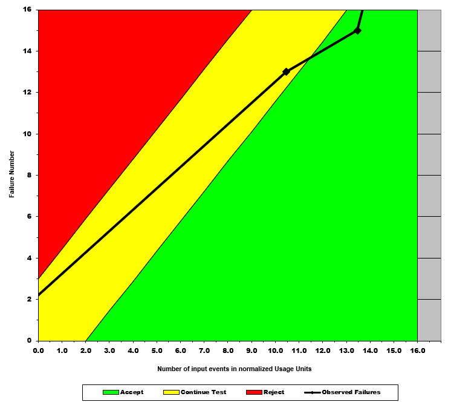

Double MTTF, to 3.33 hours to failure:

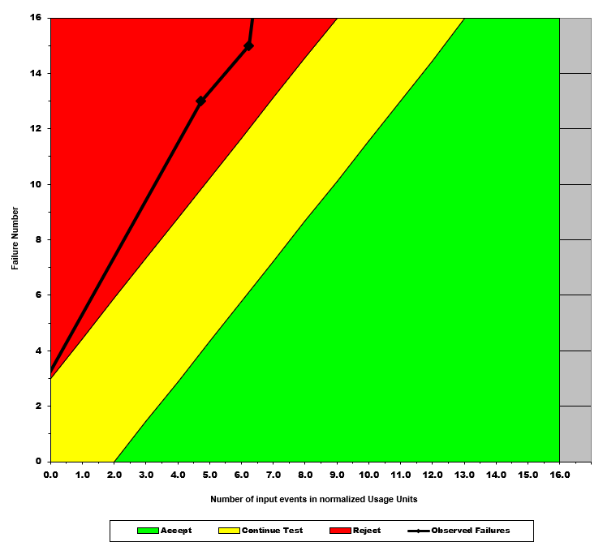

Half MTTF, to 0.833 hours to failure:

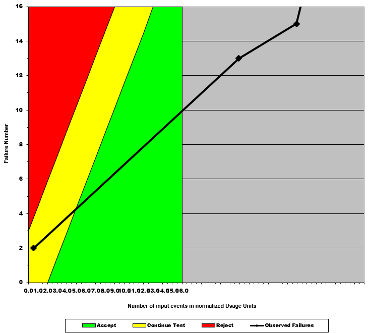

RDC provides an easy method of quantitatively judging whether a SUT is ready for release. The analysis provides an easily interpretable graph that indicates whether additional testing is necessary, or if the SUT can be rejected or accepted. A disadvantage is that developer and user risks must be determined, which might not be readily available, or something easy to calculate.

# Comparison of Results

Both analyses indicated, in the data ranges visible, that the SUT was becoming more reliable. Unfortunately, due to the limitations of the RDC tool, the entire dataset was not visible for assessment. Likewise, the models were not available in the CASRE tool for a proper analysis.

# Discussion on Similarity and Differences of the Two Techniques

Both techniques provide quantifiable justification for accepting or rejecting the SUT. The specifics of how the limit is set is different, so each may be applicable depending on how the client has set their requirements.

# How the team work/effort was divided and managed

The entire team attempted to set up the tools, as there was much debugging required in the installation. Analysis results were discussed together.

# Difficulties encountered, challenges overcome, and lessons learned

This assignment is quite broken. Dr. Far recommends not using STRAT. CASRE requires a lot of troubleshooting to install, and still did not fully work. C-SFRAT required another version to be downloaded from the Github repo to work. The RDC tool is poorly made, using hardcoded values and unchangeable region boundaries. The dataset was in an inappropriate form for the analyses. The entire assignment should be updated or scrapped.
